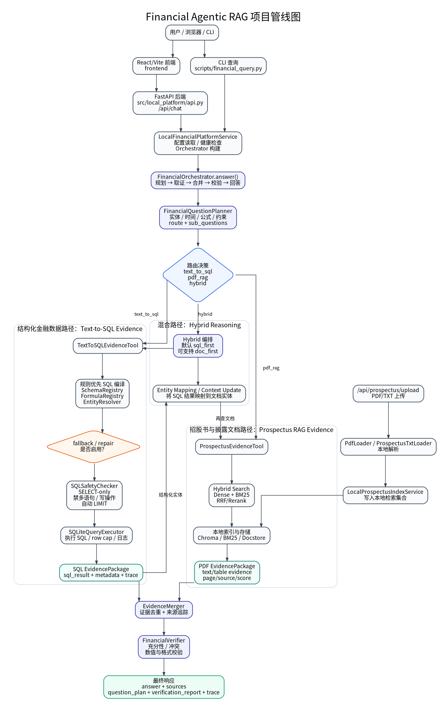

# Financial Agentic RAG

一个 **本地优先（local-first）的金融 Agentic RAG 项目**，用于把结构化金融数据库、招股书 / 披露文件检索、Agent 编排、证据合并、答案校验和 FastAPI + React 平台串成一条可审计的金融问答管线。

## 项目解决什么问题

传统 RAG 只适合回答文档类问题，而金融问答往往同时需要：

- **结构化数据证据**：例如财报指标、基金持仓、排名、聚合统计、时间区间筛选。
- **非结构化披露证据**：例如招股书、风险披露、投资策略、费用说明、基金经理描述。
- **混合推理**：先从数据库查出实体或数值，再回到披露文档里找解释、来源和上下文。
- **可审计输出**：答案必须带来源、执行路径、计划和校验结果，而不是只返回一段自然语言。

本项目通过 `planner → router → SQL / PDF RAG / hybrid → evidence merger → verifier → answer` 的方式实现上述流程。

## 核心能力

- 本地优先：SQLite、上传文件、索引、BM25、Chroma、日志和 trace 默认保留在本机。
- SQL-first 金融问答：面向结构化金融数据，优先通过规则化 Text-to-SQL 生成证据。
- 招股书 RAG：支持 PDF/TXT 上传、解析、本地索引和检索。
- Agentic 编排：根据问题自动路由到 `text_to_sql`、`pdf_rag` 或 `hybrid`。
- 混合证据链：支持 `sql_first` 风格的多步问题处理。
- SQL 安全网关：只允许 `SELECT`，拒绝多语句、注释、写操作、DDL 和危险 SQLite 操作，并为非聚合查询补默认 `LIMIT`。
- 证据合并与校验：对证据去重、保留来源追踪，并进行充分性、冲突、格式和数值校验。
- 本地 Web Demo：FastAPI 后端 + React/Vite 前端，无登录即可本地运行。
- 可检查输出：返回 `answer`、`sources`、`question_plan`、`verification_report` 和 `trace`。

## 项目管线图



下面保留 Mermaid 文本版，便于后续维护和复制：

```mermaid
flowchart LR
  U["用户 / 浏览器 / CLI"]
  FE["React/Vite 前端\nfrontend"]
  CLI["CLI 查询\nscripts/financial_query.py"]
  API["FastAPI 后端\nsrc/local_platform/api.py\n/api/chat"]
  SVC["LocalFinancialPlatformService\n配置读取 / 健康检查 / Orchestrator 构建"]

  U --> FE --> API --> SVC
  U --> CLI --> SVC

  SVC --> ORCH["FinancialOrchestrator.answer()\n规划 → 取证 → 合并 → 校验 → 回答"]
  ORCH --> PLAN["FinancialQuestionPlanner\n抽取实体 / 时间 / 公式 / 约束\n生成 route 与 sub_questions"]
  PLAN --> ROUTE{"路由决策\ntext_to_sql / pdf_rag / hybrid"}

  subgraph SQL["结构化金融数据路径：Text-to-SQL Evidence"]
    SQL_TOOL["TextToSQLEvidenceTool"] --> SQL_RULE["规则优先 SQL 编译\nSchemaRegistry + FormulaRegistry + EntityResolver"]
    SQL_RULE --> SQL_FALLBACK{"是否启用 fallback / repair"}
    SQL_FALLBACK -->|默认关闭| SQL_SAFE["SQLSafetyChecker\nSELECT-only / 禁止多语句与写操作 / 自动 LIMIT"]
    SQL_FALLBACK -->|可选 LoRA/API/repair| SQL_SAFE
    SQL_SAFE --> SQL_EXEC["SQLiteQueryExecutor\n执行 SQL / row cap / 日志"]
    SQL_EXEC --> SQL_EVIDENCE["SQL EvidencePackage\nsql_result + metadata + trace"]
  end

  subgraph PDF["招股书与披露文档路径：Prospectus RAG Evidence"]
    PDF_TOOL["ProspectusEvidenceTool"] --> PDF_SEARCH["Hybrid Search\nDense + BM25 + RRF/Rerank"]
    PDF_SEARCH --> PDF_INDEX["本地索引与存储\nChroma / BM25 / Docstore"]
    PDF_INDEX --> PDF_EVIDENCE["PDF EvidencePackage\ntext/table/image/multimodal evidence + page/source/score"]
  end

  subgraph HY["混合路径：Hybrid Reasoning"]
    HYBRID["Hybrid 编排\n默认 sql_first，可支持 doc_first"] --> ENTITY_MAP["Entity Mapping / Context Update\n将 SQL 结果映射到文档实体"]
  end

  ROUTE -->|text_to_sql| SQL_TOOL
  ROUTE -->|pdf_rag| PDF_TOOL
  ROUTE -->|hybrid| HYBRID
  HYBRID --> SQL_TOOL
  ENTITY_MAP --> PDF_TOOL
  SQL_EVIDENCE --> ENTITY_MAP

  SQL_EVIDENCE --> MERGE["EvidenceMerger\n证据去重 + 来源追踪"]
  PDF_EVIDENCE --> MERGE
  MERGE --> VERIFY["FinancialVerifier\n充分性 / 冲突 / 数值与格式校验"]
  VERIFY --> RESP["最终响应\nanswer + sources + question_plan + verification_report + trace"]

  UPLOAD["/api/prospectus/upload\nPDF/TXT 上传"] --> PARSE["PdfLoader / ProspectusTxtLoader\n本地解析"]
  PARSE --> INDEX_SVC["LocalProspectusIndexService\n写入本地检索集合"]
  INDEX_SVC --> PDF_INDEX
```



## 架构分层

```text
frontend/                  React/Vite 本地演示界面
src/local_platform/         FastAPI API、平台服务、配置、上传与索引接入
src/agentic/                Planner、Orchestrator、EvidenceMerger、Verifier、共享类型
src/financial_sql/          Schema registry、实体解析、公式注册、SQL 安全检查、SQLite 执行、Text-to-SQL evidence
src/prospectus_evidence/    招股书证据工具、TXT loader、ElementDocstore 支持
src/ingestion/              文档加载、切分、embedding、索引和存储管线
src/core/                   RAG 契约、查询引擎、响应组装、trace 能力
scripts/                    启动、查询、摄取、评估等 CLI 工具
docs/financial/             金融 Agentic RAG 设计文档、运行文档和领域规则
config/                     配置模板、prompt 与本地配置入口
tests/                      单元测试、集成测试、端到端测试和 fixtures
```

运行期目录如 `data/`、`logs/`、`config/settings.yaml`、上传文件、SQLite 数据库、Chroma 存储和 BM25 索引通常不会提交到 Git。

## 问答链路

### 1. 入口层

用户可以通过两种方式提问：

- 前端浏览器页面调用 `POST /api/chat`。
- CLI 脚本调用本地查询逻辑。

FastAPI 后端会把请求交给 `LocalFinancialPlatformService`，由该服务读取配置、检查 SQLite 数据库路径，并构建 `FinancialOrchestrator`。

### 2. Planner 与 Router

`FinancialQuestionPlanner` 会对问题进行规则化分析，包括：

- 金融实体：公司、基金、证券、指标等。
- 时间范围：年份、季度、报告期等。
- 任务类型：事实查询、排名、聚合、解释、披露检索、混合问题。
- 公式与指标约束。
- 证据需求。
- 子问题拆解。

随后生成路由：

```text
text_to_sql  -> 结构化数据库问题
pdf_rag      -> 招股书 / 披露文档问题
hybrid       -> 同时需要 SQL 与文档证据的问题
```

### 3. Text-to-SQL 路径

结构化金融数据问题走 `TextToSQLEvidenceTool`：

```text
QuestionPlan
  -> SchemaRegistry / FormulaRegistry / EntityResolver
  -> rule-first SQL candidate
  -> optional LoRA/API/repair fallback
  -> SQLSafetyChecker
  -> SQLiteQueryExecutor
  -> SQL EvidencePackage
```

默认策略偏保守：

- 先使用确定性规则生成 SQL。
- fallback / repair 默认关闭，需要显式配置。
- 所有候选 SQL 必须通过安全检查。
- 只允许 `SELECT`。
- 自动限制非聚合查询返回行数。
- 执行结果会被包装为可追踪的 `EvidencePackage`。

### 4. 招股书 RAG 路径

文档类问题走 `ProspectusEvidenceTool`：

```text
question
  -> hybrid search
  -> dense / BM25 / rerank
  -> local index / docstore
  -> PDF/TXT evidence
  -> EvidencePackage
```

证据会保留文档来源、页码、section、chunk、score、表格占位信息等 metadata，方便后续答案引用和调试。

### 5. Hybrid 路径

混合问题会先拆分为子任务。默认模式偏 `sql_first`：

```text
先用 SQL 查结构化实体或数值
  -> 将 SQL 结果映射为文档检索上下文
  -> 再检索招股书 / 披露文件
  -> 合并 SQL 与 PDF 证据
```

适合这类问题：

- “某基金第一大重仓股是谁？招股书里如何描述相关风险？”
- “先找出某指标最高的公司，再解释其披露文件中的业务变化。”
- “根据数据库确定基金/公司，再从招股书中提取投资策略或费用说明。”

### 6. 合并、校验与输出

`EvidenceMerger` 会对 SQL 和文档证据去重并保留来源追踪。`FinancialVerifier` 会检查：

- 是否存在证据。
- 证据是否足够回答问题。
- SQL 与文档证据是否冲突。
- 数值、单位和格式是否符合预期。
- 来源优先级和状态是否合理。

最终响应结构示例：

```json
{
  "answer": "自然语言答案",
  "sources": [],
  "question_plan": {},
  "verification_report": {},
  "trace": {}
}
```

## 快速开始

### 1. 克隆仓库

```bash
git clone https://github.com/lhy0525/Financial-Agentic-RAG.git
cd Financial-Agentic-RAG
```

### 2. 创建 Python 环境

Windows PowerShell：

```powershell
python -m venv .venv
.\.venv\Scripts\python.exe -m pip install -U pip
.\.venv\Scripts\python.exe -m pip install -e ".[dev]"
```

macOS / Linux：

```bash
python -m venv .venv
source .venv/bin/activate
python -m pip install -U pip
python -m pip install -e ".[dev]"
```

### 3. 准备配置

复制配置模板：

```bash
cp config/settings.example.yaml config/settings.yaml
```

Windows PowerShell：

```powershell
copy config\settings.example.yaml config\settings.yaml
```

SQLite 数据库路径解析优先级：

1. 环境变量 `FINANCIAL_DEMO_DB_PATH`
2. `config/settings.yaml` 中的 `financial_platform.sql_db_path`
3. 如果前两者都不存在，`/api/health` 和 `/api/chat` 会返回未就绪状态

配置片段示例：

```yaml
financial_platform:
  sql_db_path: "../data/sqlite/financial_demo.sqlite"
  host: "127.0.0.1"
  port: 8010
  cors_origins:
    - "http://localhost:5173"
    - "http://127.0.0.1:5173"
  prospectus_enabled: true
  prospectus_indexing_enabled: true
  prospectus_collection: "prospectus_uploads"
  upload_dir: "../data/local_platform_uploads"
  text2sql_agent:
    enable_lora_fallback: false
    lora_endpoint: ""
    enable_api_fallback: false
    api_model: ""
    api_endpoint: ""
    api_key: ""
    sql_examples_path: ""
    sql_examples_top_k: 3
    enable_empty_result_repair: false
    max_repair_attempts: 2
```

### 4. 启动后端

Windows PowerShell：

```powershell
$env:FINANCIAL_DEMO_DB_PATH="D:\path\to\financial_demo.sqlite"
.\.venv\Scripts\python.exe scripts\start_local_platform.py
```

macOS / Linux：

```bash
export FINANCIAL_DEMO_DB_PATH="/path/to/financial_demo.sqlite"
python scripts/start_local_platform.py
```

后端默认监听：

```text
http://127.0.0.1:8010
```

### 5. 启动前端

```bash
cd frontend
npm install
npm run dev
```

前端默认地址：

```text
http://127.0.0.1:5173
```

Vite 开发服务器会把 `/api` 请求代理到本地 FastAPI 后端。

## CLI 使用

运行一次 SQL-backed 查询：

```bash
python scripts/financial_query.py "你的金融问题" --db /path/to/financial_demo.sqlite
```

输出完整 JSON：

```bash
python scripts/financial_query.py "你的金融问题" --db /path/to/financial_demo.sqlite --json
```

查看帮助：

```bash
python scripts/financial_query.py --help
```

## 本地平台 API

```text
GET    /api/health
GET    /api/platform
POST   /api/chat
POST   /api/prospectus/upload
GET    /api/history
DELETE /api/history
```

示例请求：

```bash
curl -X POST http://127.0.0.1:8010/api/chat   -H "Content-Type: application/json"   -d '{"question":"2021年某基金第一大重仓股是谁？"}'
```

## 招股书上传与索引

浏览器 Demo 支持单文件上传 `.pdf` 或 `.txt`。上传后会：

1. 保存到本地 `upload_dir`。
2. 使用 PDF/TXT loader 解析文本。
3. 写入配置的本地 prospectus collection。
4. 返回索引状态，例如 `indexed_searchable`、`already_indexed` 或 `index_failed`。

批量导入 PDF 时建议使用 CLI：

```bash
python scripts/ingest.py   --path "/path/to/prospectus-pdfs"   --financial-prospectus   --config config/settings.yaml
```

## 测试

后端：

```bash
python -m pytest tests/unit
python -m pytest tests/integration
```

前端：

```bash
cd frontend
npm test
npm run build
```

## 项目边界

当前仓库刻意保持为本地优先、轻量级 Demo，不默认提供：

- OAuth / JWT 登录认证
- 多用户隔离
- 云端上传与托管文件存储
- 托管向量数据库
- 生产级部署、监控和权限治理

这些能力可以作为后续工程化方向，但不属于当前本地平台的默认边界。

## Roadmap

- 增强 PDF 表格、图片、图表等 element-level evidence 抽取。
- 完善原始表格重构和表格感知检索。
- 扩展 `sql_first` / `doc_first` hybrid 子问题链路。
- 扩大 Text-to-SQL 规则覆盖面和评测集。
- 增加 route、SQL、PDF、hybrid、verifier 维度的评测报告。
- 为 trace、证据、SQL 执行结果增加更直观的前端调试视图。
- 增加 CI：后端测试、前端测试、lint 和 build。
- 如果计划开源分发，补充正式 `LICENSE` 文件。

## 免责声明

本项目用于工程研究、学习和演示，不构成投资建议、财务建议或法律建议。真实业务场景需要结合数据质量、合规要求、权限控制和人工审核流程。
